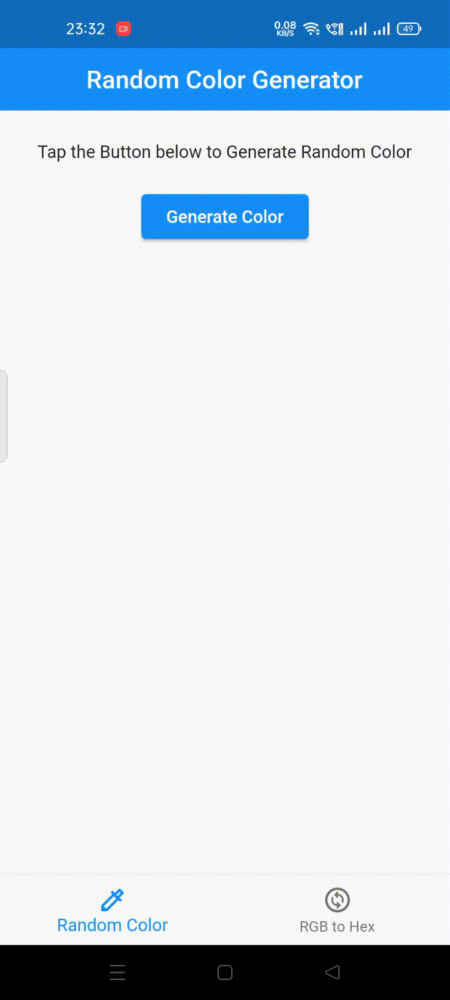

## Color App
A Flutter application which has three main features.
```
1. Generate Random Colors
2. Convert the RGB values set by the user to generate the desired Color
3. Show the names of the Colors with additional information using The Color API
```
Take a look at some of the Screen Recordings below.

## Screen Recordings
&nbsp;
&nbsp;

## Info
* API used - [The Color API](https://www.thecolorapi.com/)
* State Management - [GetX](https://pub.dev/packages/get)
* Architecture - MVC(Model-View-Controller)
* Packages used - [HTTP](https://pub.dev/packages/http), [GetX](https://pub.dev/packages/get), [Random String](https://pub.dev/packages/random_string)

## Other Features
The app has a Simple UI with good UX. This is highlighted by the fact that it has -
```
1. Sliders to change the RGB values without much hassle
2. Up and Down buttons for minute changes in the RGB values
3. Text Fields for specific changes in the RGB values
```

## Contact Me
* [LinkedIn](https://www.linkedin.com/in/anshuman-mahapatra/)
* Email - anshumanmahapatra214@gmail.com
